//1 capturas de LUIS ANGEL DIONICIO BARTOLO

DATABASE: GET en Thunder Client 
GET http://127.0.0.1:8000/api/movies/

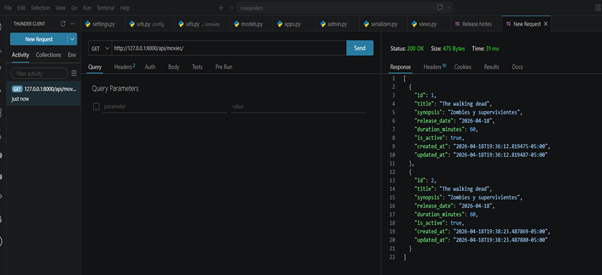
//2
POST:http://127.0.0.1:8000/api/movies/
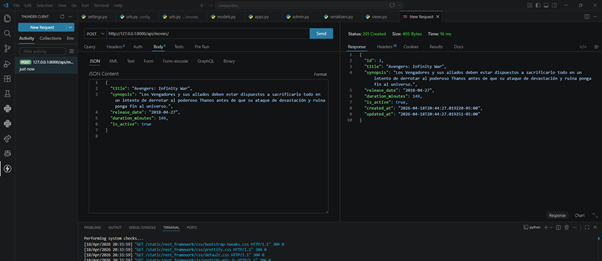
base de datos
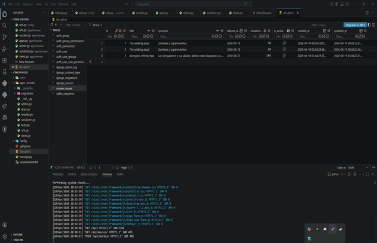

//3

PUT:
http://127.0.0.1:8000/api/movies/3/
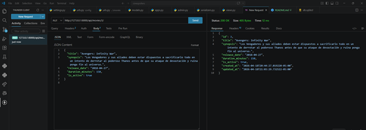

base de datos:
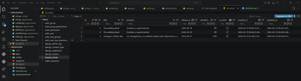

//4
//DELETE:

http://127.0.0.1:8000/api/movies/2/

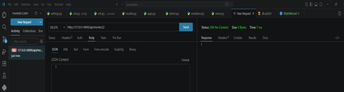

base de datos:

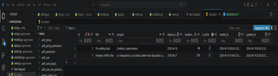

///EVIDENCIAS DE Diego Sotelo Garcia

1//GET http://127.0.0.1:8000/api/v1/movies/

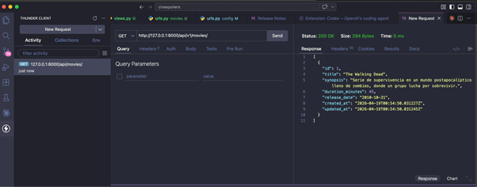

2//POST http://127.0.0.1:8000/api/v1/movies/

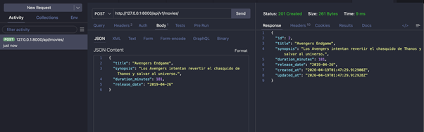

3//PUT  http://127.0.0.1:8000/api/v1/movies/1/

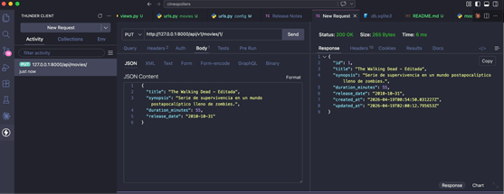

4//DELETE http://127.0.0.1:8000/api/v1/movies/1/     

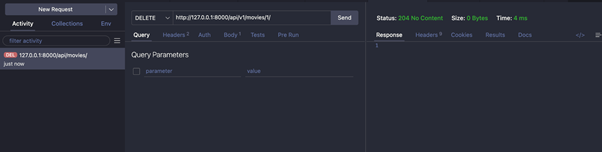

5// Base de datos
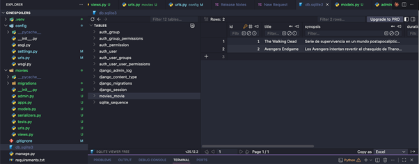

////EVIDENCIAS JERONIMO ORTIZ

//GET 
Probando GET en THUNDER CLIENT  : http://127.0.0.1:8000/api/v1/movies/ http://127.0.0.1:8000/api/v1/movies/

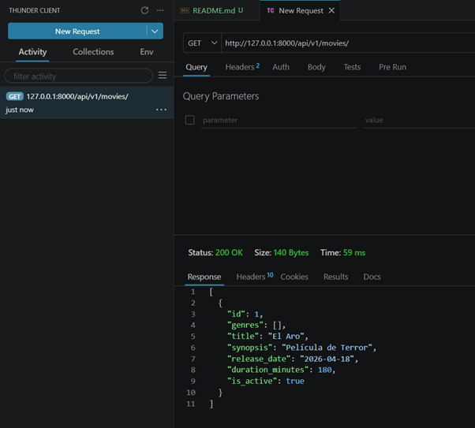

//POST http://127.0.0.1:8000/api/v1/movies/ 

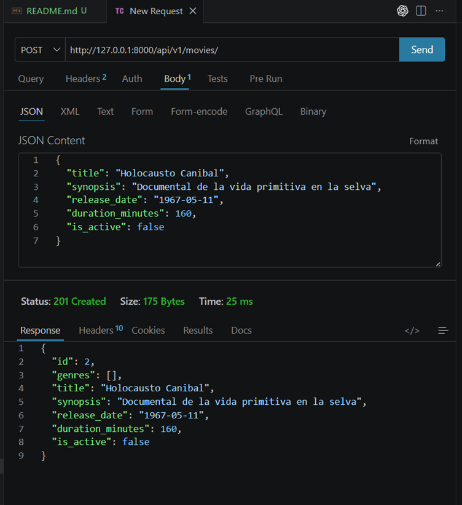

//PUT

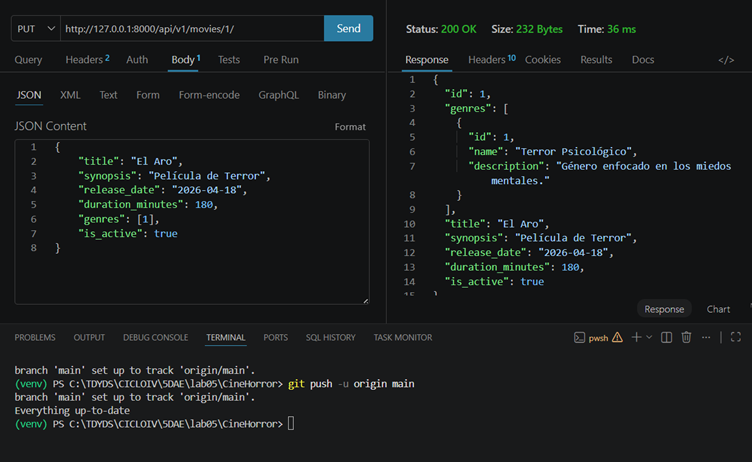

//DELETE

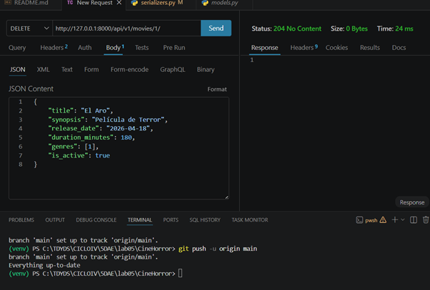